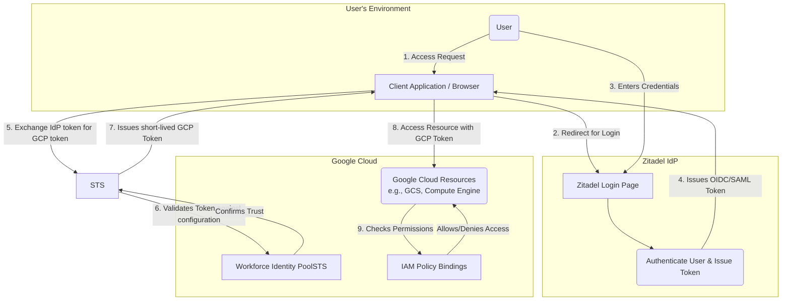

```mermaid
graph TD
    subgraph User's Environment
        U(User)
        App[Client Application / Browser]
    end

    subgraph Zitadel [Zitadel IdP]
        Z_Login[Zitadel Login Page]
        Z_Auth(Authenticate User & Issue Token)
    end

    subgraph GCP [Google Cloud]
        WIFP[Workforce Identity PoolSTS]
        IAM[IAM Policy Bindings]
        GCP_Res(Google Cloud Resources <br> e.g., GCS, Compute Engine)
    end

    U -- 1. Access Request --> App
    App -- 2. Redirect for Login --> Z_Login
    U -- 3. Enters Credentials --> Z_Login
    Z_Login --> Z_Auth
    Z_Auth -- 4. Issues OIDC/SAML Token --> App
    App -- 5. Exchange IdP token for GCP token --> STS
    STS -- 6. Validates Token against configuration --> WIFP
    WIFP -- Confirms Trust --> STS
    STS -- 7. Issues short-lived GCP Token --> App
    App -- 8. Access Resource with GCP Token --> GCP_Res
    GCP_Res -- 9. Checks Permissions --> IAM
    IAM -- Allows/Denies Access --> GCP_Res

```
