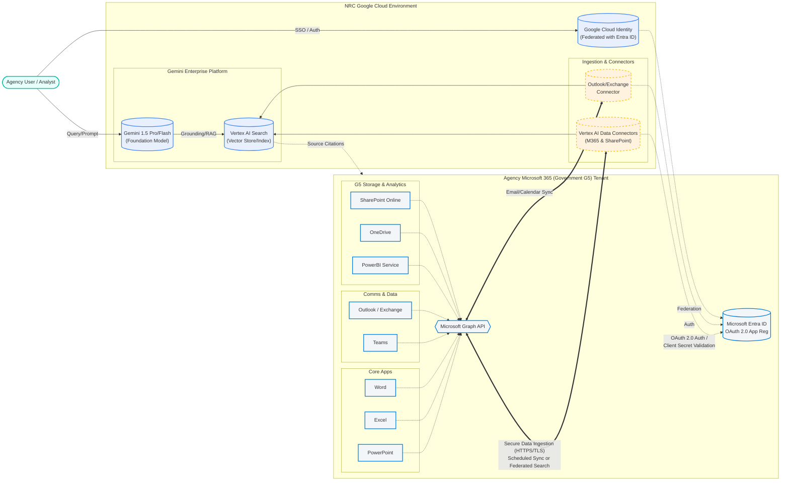

```mermaid
flowchart LR
    %% Styles
    classDef m365 fill:#f3f6f9,stroke:#0078d4,stroke-width:2px;
    classDef gcp fill:#e8f0fe,stroke:#4285f4,stroke-width:2px;
    classDef connector fill:#fff3e0,stroke:#fbbc04,stroke-width:2px,stroke-dasharray: 5 5;
    classDef user fill:#e6fffa,stroke:#00bfa5,stroke-width:2px;

    %% User Layer
    User([Agency User / Analyst]):::user

    %% NRC Microsoft 365 G5 Environment
    subgraph M365 ["Agency Microsoft 365 (Government G5) Tenant"]
        direction TB
        
        %% Identity
        Entra[(Microsoft Entra ID<br/>OAuth 2.0 App Reg)]:::m365

        %% Core Apps
        subgraph CoreApps ["Core Apps"]
            Word[Word]:::m365
            Excel[Excel]:::m365
            PPT[PowerPoint]:::m365
        end

        %% Communication
        subgraph Comm ["Comms & Data"]
            Outlook[Outlook / Exchange]:::m365
            Teams[Teams]:::m365
        end

        %% G5 Data Storage
        subgraph Storage ["G5 Storage & Analytics"]
            SP[SharePoint Online]:::m365
            OD[OneDrive]:::m365
            PBI[PowerBI Service]:::m365
        end
        
        %% Graph API Gateway
        GraphAPI{{"Microsoft Graph API"}}:::m365
    end

    %% NRC Google Cloud Environment
    subgraph GCP ["NRC Google Cloud Environment"]
        direction TB

        %% Integration Layer
        subgraph Integration ["Ingestion & Connectors"]
            Connector[("Vertex AI Data Connectors<br/>(M365 & SharePoint)")]:::connector
            M365Connector[("Outlook/Exchange<br/>Connector")]:::connector
        end

        %% Gemini Layer
        subgraph GenAI ["Gemini Enterprise Platform"]
            VertexSearch[("Vertex AI Search<br/>(Vector Store/Index)")]:::gcp
            Gemini[("Gemini 1.5 Pro/Flash<br/>(Foundation Model)")]:::gcp
        end
        
        %% Identity Mapping
        CloudIdentity[("Google Cloud Identity<br/>(Federated with Entra ID)")]:::gcp
    end

    %% Connections
    
    %% Data Flow from Apps to Graph
    Word & Excel & PPT & Outlook & Teams & SP & OD & PBI -.-> GraphAPI

    %% Connector to Graph API
    GraphAPI <== "Secure Data Ingestion (HTTPS/TLS)<br/>Scheduled Sync or Federated Search" ==> Connector
    GraphAPI <== "Email/Calendar Sync" ==> M365Connector

    %% Authentication Flow
    Connector -. "OAuth 2.0 Auth /<br/>Client Secret Validation" .-> Entra
    M365Connector -. "Auth" .-> Entra

    %% Connector to Index
    Connector --> VertexSearch
    M365Connector --> VertexSearch

    %% Gemini to Index
    Gemini -- "Grounding/RAG" --> VertexSearch

    %% User Interactions
    User -- "Query/Prompt" --> Gemini
    User -- "SSO / Auth" --> CloudIdentity
    CloudIdentity -. "Federation" .-> Entra

    %% Context Link
    VertexSearch -. "Source Citations" .-> M365
```
