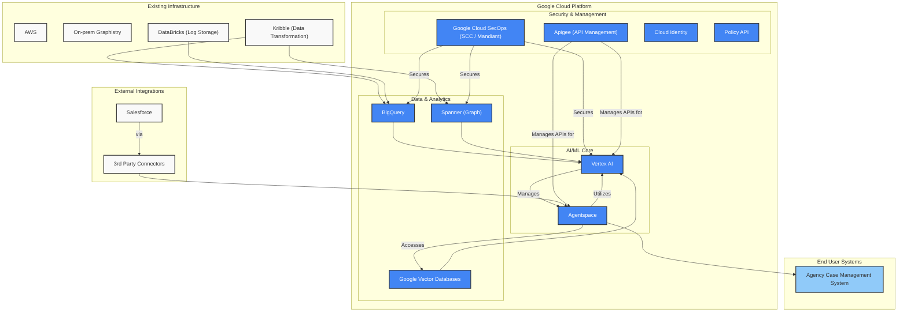

```mermaid
graph TD
    subgraph "Existing Infrastructure"
        AWS
        OnPrem_Graphistry["On-prem Graphistry"]
        DataBricks["DataBricks (Log Storage)"]
        Kribble["Kribble (Data Transformation)"]
    end

    subgraph "Google Cloud Platform"
        subgraph "Security & Management"
            SecOps["Google Cloud SecOps (SCC / Mandiant)"]
            Apigee["Apigee (API Management)"]
            CloudIdentity["Cloud Identity"]
            PolicyAPI["Policy API"]
        end

        subgraph "Data & Analytics"
            BigQuery
            Spanner["Spanner (Graph)"]
            VectorDB["Google Vector Databases"]
        end

        subgraph "AI/ML Core"
            Agentspace
            VertexAI["Vertex AI"]
        end
    end

    subgraph "External Integrations"
        Salesforce
        ThirdPartyConnectors["3rd Party Connectors"]
    end

    subgraph "End User Systems"
        CaseManagement["Agency Case Management System"]
    end

    %% Data Flow and Connections
    Kribble --> BigQuery
    Kribble --> Spanner
    DataBricks --> BigQuery

    BigQuery --> VertexAI
    Spanner --> VertexAI
    VectorDB --> VertexAI

    VertexAI -- Manages --> Agentspace
    Agentspace -- Utilizes --> VertexAI
    Agentspace -- Accesses --> VectorDB

    Salesforce -- via --> ThirdPartyConnectors
    ThirdPartyConnectors --> Agentspace

    Agentspace --> CaseManagement

    %% Security and Management Connections
    SecOps -- Secures --> BigQuery
    SecOps -- Secures --> Spanner
    SecOps -- Secures --> VertexAI
    Apigee -- Manages APIs for --> Agentspace
    Apigee -- Manages APIs for --> VertexAI

    %% Styling
    classDef gcp fill:#4285F4,stroke:#333,stroke-width:2px,color:#fff;
    class BigQuery,Spanner,VectorDB,Agentspace,VertexAI,SecOps,Apigee,CloudIdentity,PolicyAPI gcp;

    classDef existing fill:#f9f9f9,stroke:#333,stroke-width:2px,color:#333;
    class AWS,OnPrem_Graphistry,DataBricks,Kribble existing;

    classDef external fill:#f9f9f9,stroke:#333,stroke-width:2px,color:#333;
    class Salesforce,ThirdPartyConnectors external;

    classDef enduser fill:#90caf9,stroke:#333,stroke-width:2px,color:#333;
    class CaseManagement enduser;
```
