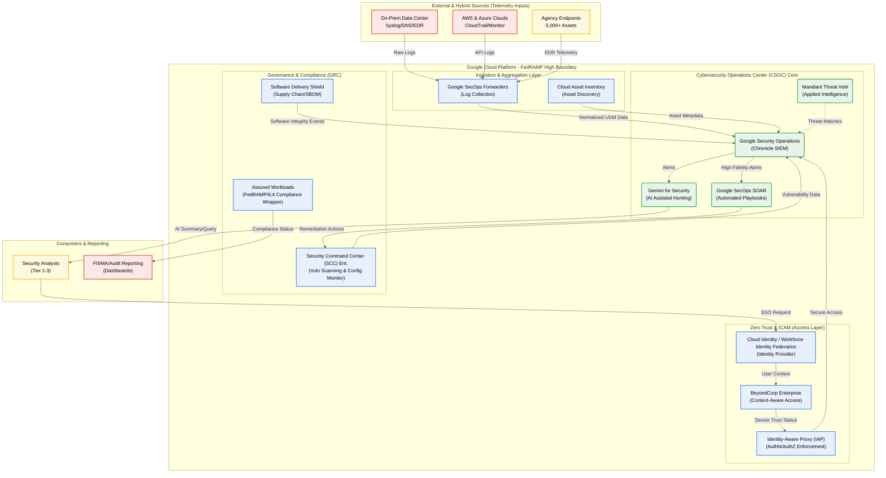

```mermaid
graph TD
   %% Global Styles
   classDef cloud fill:#e8f0fe,stroke:#4285f4,stroke-width:2px,color:#000;
   classDef onprem fill:#fce8e6,stroke:#ea4335,stroke-width:2px,color:#000;
   classDef secOps fill:#e6f4ea,stroke:#34a853,stroke-width:2px,color:#000;
   classDef users fill:#fff8e1,stroke:#fbbc04,stroke-width:2px,color:#000;


   subgraph "External & Hybrid Sources (Telemetry Inputs)"
       A1["On-Prem Data Center<br/>Syslog/DNS/EDR"]:::onprem
       A2["AWS & Azure Clouds<br/>CloudTrail/Monitor"]:::onprem
       A3["Agency Endpoints<br/>5,000+ Assets"]:::users
   end


   subgraph "Google Cloud Platform - FedRAMP High Boundary"
      
       subgraph "Ingestion & Aggregation Layer"
           B1["Google SecOps Forwarders<br/>(Log Collection)"]:::cloud
           B2["Cloud Asset Inventory<br/>(Asset Discovery)"]:::cloud
       end


       subgraph "Cybersecurity Operations Center (CSOC) Core"
           C1("Google Security Operations<br/>(Chronicle SIEM)"):::secOps
           C2("Google SecOps SOAR<br/>(Automated Playbooks)"):::secOps
           C3("Mandiant Threat Intel<br/>(Applied Intelligence)"):::secOps
           C4("Gemini for Security<br/>(AI Assisted Hunting)"):::secOps
       end


       subgraph "Governance & Compliance (GRC)"
           D1["Security Command Center (SCC) Ent.<br/>(Vuln Scanning & Config Monitor)"]:::cloud
           D2["Assured Workloads<br/>(FedRAMP/IL4 Compliance Wrapper)"]:::cloud
           D3["Software Delivery Shield<br/>(Supply Chain/SBOM)"]:::cloud
       end


       subgraph "Zero Trust & ICAM (Access Layer)"
           E1["Cloud Identity / Workforce Identity Federation<br/>(Identity Provider)"]:::cloud
           E2["BeyondCorp Enterprise<br/>(Context-Aware Access)"]:::cloud
           E3["Identity-Aware Proxy (IAP)<br/>(AuthN/AuthZ Enforcement)"]:::cloud
       end
   end


   subgraph "Consumers & Reporting"
       F1["Security Analysts<br/>(Tier 1-3)"]:::users
       F2["FISMA/Audit Reporting<br/>(Dashboards)"]:::onprem
   end


   %% Data Flow Connections
   A1 -->|Raw Logs| B1
   A2 -->|API Logs| B1
   A3 -->|EDR Telemetry| B1
  
   B1 -->|Normalized UDM Data| C1
   B2 -->|Asset Metadata| C1
  
   %% Intelligence Overlay
   C3 -.->|Threat Matches| C1
  
   %% AI & Automation Flow
   C1 -->|Alerts| C4
   C4 -->|AI Summary/Query| F1
   C1 -->|High Fidelity Alerts| C2
   C2 -->|Remediation Actions| D1
  
   %% GRC Integrations
   D1 -->|Vulnerability Data| C1
   D2 -->|Compliance Status| F2
   D3 -->|Software Integrity Events| C1
  
   %% Zero Trust Flow
   F1 -->|SSO Request| E1
   E1 -->|User Context| E2
   E2 -->|Device Trust Status| E3
   E3 -->|Secure Access| C1
  
   %% Links for clarification
   linkStyle default stroke:#555,stroke-width:1px;

```
