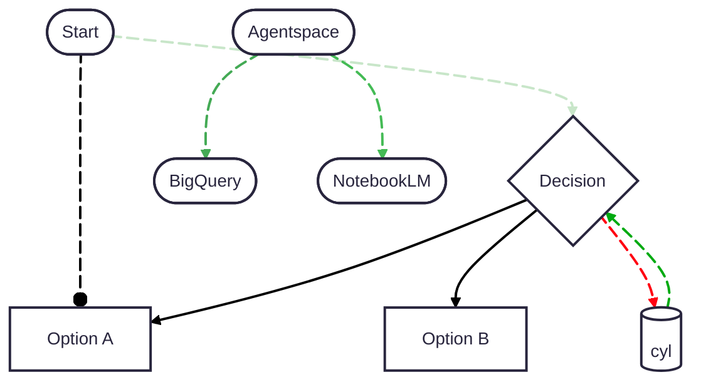

```mermaid
---
config:
  theme: redux
---
flowchart TD
    A(["Start"]) L_A_B_0@-.-> B{"Decision"}
    A L_A_C_0@--o C["Option A"]
    B --> C & D["Option B"]
    linkStyle 0 stroke:#C8E6C9,fill:none
    L_A_B_0@{ animation: slow } 
    L_A_C_0@{ animation: slow }

  cyl@{ shape: cyl }

  B db1@--> cyl
  db1@{ animation: slow }
  linkStyle 4 stroke:#FF0011,fill:none

  cyl db2@--> B
  db2@{ animation: fast }
  linkStyle 5 stroke:#00AA11,fill:none


  Agentspace(["Agentspace"])
  BigQuery(["BigQuery"])
  NLM(["NotebookLM"])
  Agentspace lineAgentspace@--> BigQuery
  Agentspace lineNLM@--> NLM
  lineAgentspace@{animation: slow}
  lineNLM@{animation: slow}
  linkStyle 6 stroke:#44AA55, fill:none
  linkStyle 7 stroke:#44BB55, fill:none
```
