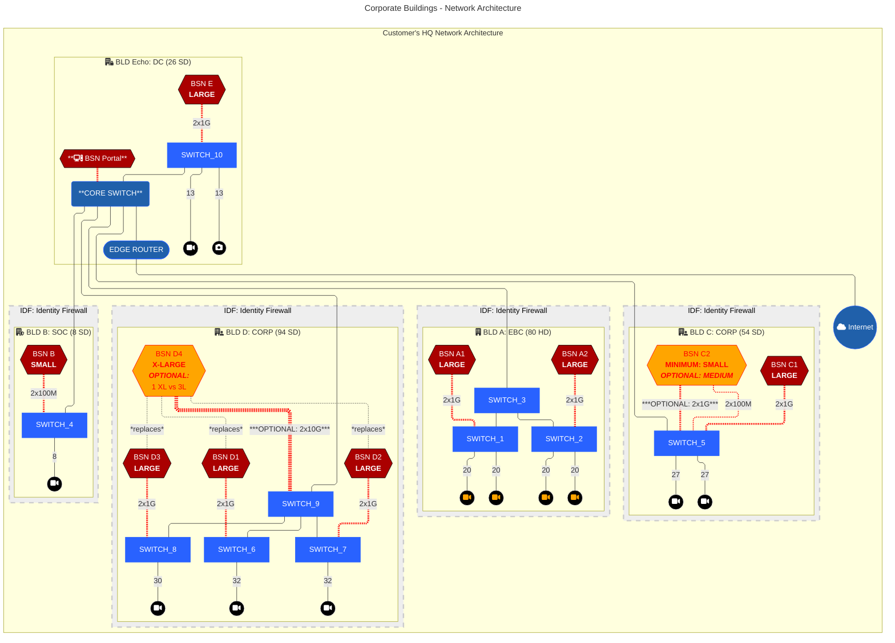

```mermaid
---
title: Corporate Buildings - Network Architecture
---
%%{init: {"flowchart": {"defaultRenderer": "elk","htmlLabels": true, "curve": "linear"}} }%%

flowchart TB

subgraph CUSTOMER_HQ["Customer's HQ Network Architecture"]

%% Public Cloud
    CLOUD(("fa:fa-cloud Internet"))

%% Buildings

%% Building E with 26 SD Cameras
    subgraph BLDG_Echo["`fa:fa-building-lock BLD Echo: DC (26 SD)`"]
        direction LR
        SWITCH_10  ---|13| CAM1_SWITCH_10(("fa:fa-video")) & CAM2_SWITCH_10(("fa:fa-camera"))
        SWITCH_10 --- CORE_SWITCH("**CORE SWITCH**"):::switch
        CORE_SWITCH --- EDGE_ROUTER(["EDGE ROUTER"]):::switch

        BLDG_E_BSN_1{{"`BSN E
            **LARGE**`"}}:::bsn
        BLDG_E_BSN_1 -..-|2x1G| SWITCH_10
        linkStyle 4 stroke:#f00,stroke-width:4px,color:red;

        BSN_PORTAL{{**fa:fa-computer BSN Portal**}}:::bsn -..- CORE_SWITCH
        linkStyle 5 stroke:#f00,stroke-width:4px,color:red;
    end
    EDGE_ROUTER --- CLOUD

%% Building A w/ 80 HD Cameras
subgraph IDF_BLDG_A ["IDF: Identity Firewall"]
    subgraph BLDG_A["`fa:fa-building BLD A: EBC (80 HD)`"]
        direction TB
        SWITCH_3 --- SWITCH_1 & SWITCH_2
        SWITCH_1 ---|20| CAM1_SWITCH_1(("fa:fa-video")) & CAM2_SWITCH_1(("fa:fa-video"))
        SWITCH_2 ---|20| CAM1_SWITCH_2(("fa:fa-video")) & CAM2_SWITCH_2(("fa:fa-video"))

        BLDG_A_BSN_1{{"`BSN A1
            **LARGE**`"}}:::bsn
        BLDG_A_BSN_1 -..-|2x1G| SWITCH_1
        linkStyle 13 stroke:#f00,stroke-width:4px,color:red;
        BLDG_A_BSN_2{{"`BSN A2
            **LARGE**`"}}:::bsn
        BLDG_A_BSN_2 -..-|2x1G| SWITCH_2
        linkStyle 14 stroke:#f00,stroke-width:4px,color:red;
    end
end

%% Building B w/ 8 SD Cameras
subgraph IDF_BLDG_B ["IDF: Identity Firewall"]
    subgraph BLDG_B["`fa:fa-building-shield BLD B: SOC (8 SD)`"]
        direction TB
        SWITCH_4 ---|8| CAM1_SWITCH_4(("fa:fa-video"))

        BLDG_B_BSN_1{{"`BSN B
            **SMALL**`"}}
        BLDG_B_BSN_1 -..-|2x100M| SWITCH_4
        linkStyle 16 stroke:#f00,stroke-width:4px,color:red;
    end
end

%% Building C w/ 54 SD Cameras
subgraph IDF_BLDG_C ["IDF: Identity Firewall"]
    subgraph BLDG_C["`fa:fa-building-user BLD C: CORP (54 SD)`"]
        direction TB
        SWITCH_5 ---|27| CAM1_SWITCH_5(("fa:fa-video")) & CAM2_SWITCH_5(("fa:fa-video"))
        BLDG_C_BSN_1{{"`BSN C1
            **LARGE**`"}}:::bsn
        BLDG_C_BSN_1 -..-|2x1G| SWITCH_5
        linkStyle 19 stroke:#f00,stroke-width:4px,color:red;
        BLDG_C_BSN_2{{"`BSN C2
            **MINIMUM: SMALL**
            ***OPTIONAL: MEDIUM***`"}}:::bsn_opt
        BLDG_C_BSN_2 -..-|2x100M| SWITCH_5
        linkStyle 20 stroke:#f00,stroke-width:2px,color:red;
        BLDG_C_BSN_2 -..-|***OPTIONAL: 2x1G***| SWITCH_5
        linkStyle 21 stroke:#f00,stroke-width:4px,color:red;
    end
end

%% Building D w/ 94 SD Cameras
subgraph IDF_BLDG_D ["IDF: Identity Firewall"]
    subgraph BLDG_D["`fa:fa-building-user BLD D: CORP (94 SD)`"]
        direction TB
        SWITCH_9 --- SWITCH_6 & SWITCH_7 & SWITCH_8
        SWITCH_6 ---|32| CAM1_SWITCH_6(("fa:fa-video"))
        SWITCH_7 ---|32| CAM1_SWITCH_7(("fa:fa-video"))
        SWITCH_8 ---|30| CAM1_SWITCH_8(("fa:fa-video"))

        BLDG_D_BSN_1{{"`BSN D1
            **LARGE**`"}}:::bsn
        BLDG_D_BSN_1 -..-|2x1G| SWITCH_6
        linkStyle 28 stroke:#f00,stroke-width:4px,color:red;
        BLDG_D_BSN_2{{"`BSN D2
            **LARGE**`"}}:::bsn
        BLDG_D_BSN_2 -..-|2x1G| SWITCH_7
        linkStyle 29 stroke:#f00,stroke-width:4px,color:red;
        BLDG_D_BSN_3{{"`BSN D3
            **LARGE**`"}}:::bsn
        BLDG_D_BSN_3 -..-|2x1G| SWITCH_8
        linkStyle 30 stroke:#f00,stroke-width:4px,color:red;
        BLDG_D_BSN_4{{"`BSN D4
            **X-LARGE**
            ***OPTIONAL:***
            1 XL vs 3L`"}}:::bsn_opt
        BLDG_D_BSN_4 -..-|***OPTIONAL: 2x10G***| SWITCH_9
        linkStyle 31 stroke:#f00,stroke-width:8px,color:red;
        BLDG_D_BSN_4 -..-|*replaces*| BLDG_D_BSN_1 & BLDG_D_BSN_2 & BLDG_D_BSN_3
    end
end

%% Route Switches between Buildings
    CORE_SWITCH --- SWITCH_3 & SWITCH_4 & SWITCH_5 & SWITCH_9

end

%% Stylings
    %% IDF
    style IDF_BLDG_A fill:#eee,stroke:#ccc,stroke-width:3px,color:#000,stroke-dasharray: 10 10
    style IDF_BLDG_B fill:#eee,stroke:#ccc,stroke-width:3px,color:#000,stroke-dasharray: 10 10
    style IDF_BLDG_C fill:#eee,stroke:#ccc,stroke-width:3px,color:#000,stroke-dasharray: 10 10
    style IDF_BLDG_D fill:#eee,stroke:#ccc,stroke-width:3px,color:#000,stroke-dasharray: 10 10

    %% Switches
    classDef switch color:#FFFFFF, stroke:#2962FF, fill:#2962FF
    class SWITCH_1,SWITCH_2,SWITCH_3,SWITCH_4,SWITCH_5,SWITCH_6,SWITCH_7,SWITCH_8,SWITCH_9,SWITCH_10 switch;

    classDef core_switches color:#FFFFFF, stroke:#2962FF, fill:#2060AA
    class CORE_SWITCH,EDGE_ROUTER,CLOUD core_switches;

    %% BSNs
    classDef bsn color:#FFFFFF, stroke:#000000, fill:#AA0000
    classDef bsn_opt color:#FF0000, stroke:#FF0000, fill:#FFA500
    class BLDG_B_BSN_1 bsn;

    %% Cameras
    classDef camera_sd color:#FFFFFF, stroke:#FFFFFF, fill:#000000
    class CAM1_SWITCH_4,CAM1_SWITCH_5,CAM2_SWITCH_5,CAM1_SWITCH_6,CAM1_SWITCH_7,CAM1_SWITCH_8,CAM1_SWITCH_10,CAM2_SWITCH_10 camera_sd
    
    classDef camera_hd color:#FFA500, stroke:#FFFFFF, fill:#000000
    class CAM1_SWITCH_1,CAM2_SWITCH_1,CAM1_SWITCH_2,CAM2_SWITCH_2 camera_hd
```
