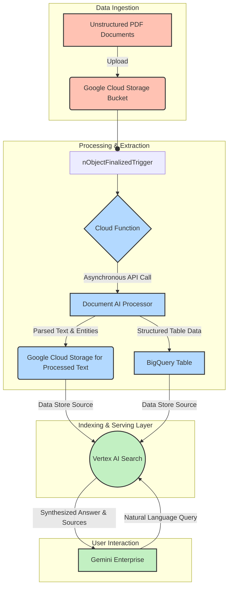

```mermaid
graph TD
    subgraph "Data Ingestion"
        A[Unstructured PDF Documents] -->|Upload| B(Google Cloud Storage Bucket);
    end

    subgraph "Processing & Extraction"
        B --onObjectFinalizedTrigger--> C{Cloud Function};
        C --Asynchronous API Call--> D[Document AI Processor];
        D --Parsed Text & Entities--> E(Google Cloud Storage for Processed Text);
        D --Structured Table Data--> F[BigQuery Table];
    end

    subgraph "Indexing & Serving Layer"
       E --Data Store Source--> G((Vertex AI Search));
       F --Data Store Source--> G;
    end

    subgraph "User Interaction"
        H[Gemini Enterprise] --Natural Language Query--> G;
        G --Synthesized Answer & Sources--> H;
    end

    style A fill:#FFC2B3,stroke:#333,stroke-width:2px
    style B fill:#FFC2B3,stroke:#333,stroke-width:2px
    style C fill:#B3D9FF,stroke:#333,stroke-width:2px
    style D fill:#B3D9FF,stroke:#333,stroke-width:2px
    style E fill:#B3D9FF,stroke:#333,stroke-width:2px
    style F fill:#B3D9FF,stroke:#333,stroke-width:2px
    style G fill:#C2F0C2,stroke:#333,stroke-width:2px
    style H fill:#C2F0C2,stroke:#333,stroke-width:2px

```
