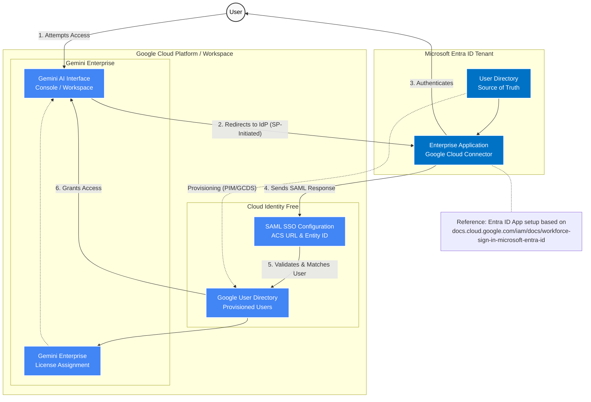

```mermaid
graph TD
    %% Define Styles
    classDef azure fill:#0072C6,stroke:#fff,stroke-width:2px,color:#fff;
    classDef google fill:#4285F4,stroke:#fff,stroke-width:2px,color:#fff;
    classDef user fill:#f9f9f9,stroke:#333,stroke-width:2px,color:#000;
    classDef connector stroke-dasharray: 5 5;

    %% User Node
    User((User)):::user

    %% Microsoft Entra ID Subgraph
    subgraph Microsoft_Entra_ID [Microsoft Entra ID Tenant]
        direction TB
        Entra_Users[User Directory<br/>Source of Truth]:::azure
        Entra_App[Enterprise Application<br/>Google Cloud Connector]:::azure
        
        Entra_Users --> Entra_App
    end

    %% Google Cloud Subgraph
    subgraph Google_Cloud [Google Cloud Platform / Workspace]
        direction TB
        
        subgraph Cloud_Identity [Cloud Identity Free]
            CI_Directory[Google User Directory<br/>Provisioned Users]:::google
            SSO_Config[SAML SSO Configuration<br/>ACS URL & Entity ID]:::google
        end
        
        subgraph Gemini_Services [Gemini Enterprise]
            Gemini_License[Gemini Enterprise<br/>License Assignment]:::google
            Gemini_App[Gemini AI Interface<br/>Console / Workspace]:::google
        end

        CI_Directory --> Gemini_License
        Gemini_License -.-> Gemini_App
    end

    %% Connections / Flow
    User -- 1. Attempts Access --> Gemini_App
    Gemini_App -- 2. Redirects to IdP (SP-Initiated) --> Entra_App
    Entra_App -- 3. Authenticates --> User
    Entra_App -- 4. Sends SAML Response --> SSO_Config
    SSO_Config -- 5. Validates & Matches User --> CI_Directory
    CI_Directory -- 6. Grants Access --> Gemini_App

    %% Provisioning Link (Implicit requirement for Cloud Identity flow)
    Entra_Users -. Provisioning (PIM/GCDS) .-> CI_Directory

    %% Note on Reference Document
    note[Reference: Entra ID App setup based on<br/>docs.cloud.google.com/iam/docs/workforce-sign-in-microsoft-entra-id]
    Entra_App -.- note
```
