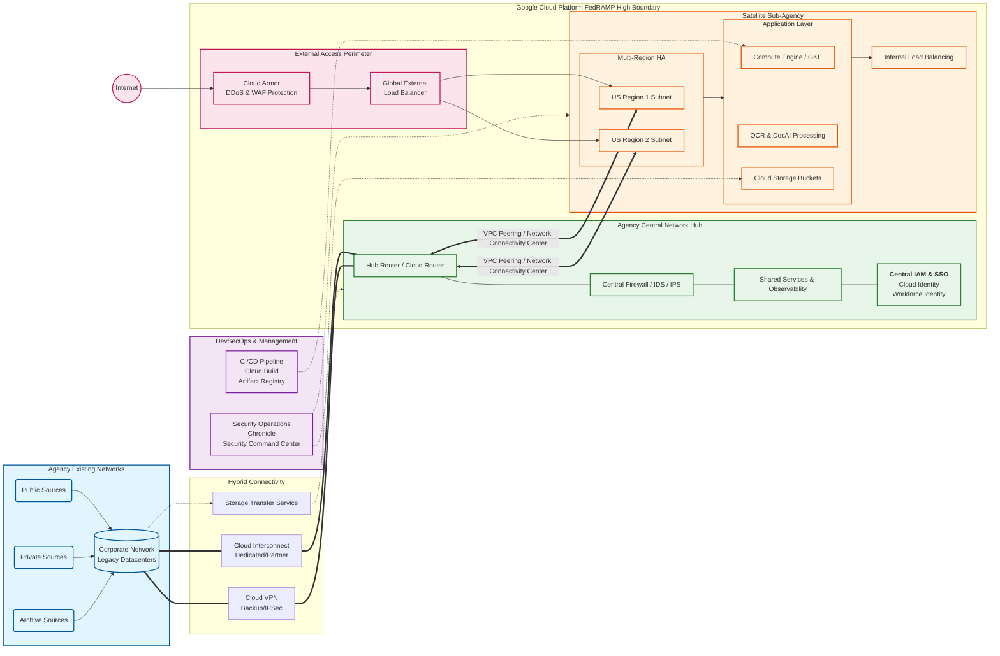

```mermaid
flowchart LR
    %% Styles
    classDef onprem fill:#e1f5fe,stroke:#01579b,stroke-width:2px;
    classDef hub fill:#e8f5e9,stroke:#2e7d32,stroke-width:2px;
    classDef tenant fill:#fff3e0,stroke:#e65100,stroke-width:2px;
    classDef ext fill:#fce4ec,stroke:#c2185b,stroke-width:2px;
    classDef ops fill:#f3e5f5,stroke:#7b1fa2,stroke-width:2px;

    %% --- ON-PREM & SOURCES ---
    subgraph OnPrem [Agency Existing Networks]
        direction TB
        PublicSrc(Public Sources)
        PrivateSrc(Private Sources)
        ArchiveSrc(Archive Sources)
        OnPremNet[("Corporate Network <br>Legacy Datacenters")]
        
        PublicSrc & PrivateSrc & ArchiveSrc --> OnPremNet
    end

    %% --- CONNECTIVITY ---
    subgraph Connectivity [Hybrid Connectivity]
        IC[Cloud Interconnect<br>Dedicated/Partner]
        VPN[Cloud VPN<br>Backup/IPSec]
        DataTransfer[Storage Transfer Service]
    end

    OnPremNet === IC & VPN
    OnPremNet -.-> DataTransfer

    %% --- GOOGLE CLOUD PLATFORM ---
    subgraph GCP [Google Cloud Platform FedRAMP High Boundary]
        
        %% 1. CENTRAL HUB
        subgraph Hub [Agency Central Network Hub]
            direction TB
            HubRouter[Hub Router / Cloud Router]
            HubFW[Central Firewall / IDS / IPS]
            SharedSvcs[Shared Services & Observability]
            IAM[<b>Central IAM & SSO</b><br>Cloud Identity<br>Workforce Identity]
            
            HubRouter --- HubFW
            HubFW --- SharedSvcs
            SharedSvcs --- IAM
        end

        %% 2. TENANT / SATELLITE SUB AGENCY (Replicated 200+ times)
        subgraph Satellite [Satellite Sub-Agency <br>Landing Zone <br>Example Tenant]
            direction TB
            
            subgraph AppLayer [Application Layer]
                Compute[Compute Engine / GKE]
                DocAI[OCR & DocAI Processing]
                Storage[Cloud Storage Buckets]
            end
            
            subgraph Regions [Multi-Region HA]
                Reg1[US Region 1 Subnet]
                Reg2[US Region 2 Subnet]
            end
            
            LB[Internal Load Balancing]
            
            Regions --> AppLayer
            AppLayer --> LB
        end

        %% 3. EXTERNAL ACCESS
        subgraph Perimeter [External Access Perimeter]
            ExtLB[Global External <br>Load Balancer]
            Armor[Cloud Armor<br>DDoS & WAF Protection]
        end

    end

    %% --- DEVSECOPS ---
    subgraph Ops [DevSecOps & Management]
        CI_CD[CI/CD Pipeline<br>Cloud Build <br> Artifact Registry]
        SecOps[Security Operations<br>Chronicle <br> Security Command Center]
    end

    %% --- CONNECTIONS ---
    
    %% Connectivity to Hub
    IC & VPN === HubRouter
    DataTransfer -.-> Storage

    %% Hub to Spoke (Peering)
    HubRouter <== "VPC Peering / Network Connectivity Center" ==> Reg1 & Reg2
    
    %% External Access Flow
    Internet((Internet)) --> Armor
    Armor --> ExtLB
    ExtLB --> Reg1 & Reg2

    %% Operations links
    CI_CD -.-> Compute
    SecOps -.-> Hub
    SecOps -.-> Satellite

    %% Class Assignments
    class OnPrem,PublicSrc,PrivateSrc,ArchiveSrc,OnPremNet onprem;
    class Hub,HubRouter,HubFW,SharedSvcs,IAM hub;
    class Satellite,AppLayer,Compute,DocAI,Storage,Regions,Reg1,Reg2,LB tenant;
    class Perimeter,ExtLB,Armor,Internet ext;
    class Ops,CI_CD,SecOps ops;
```
