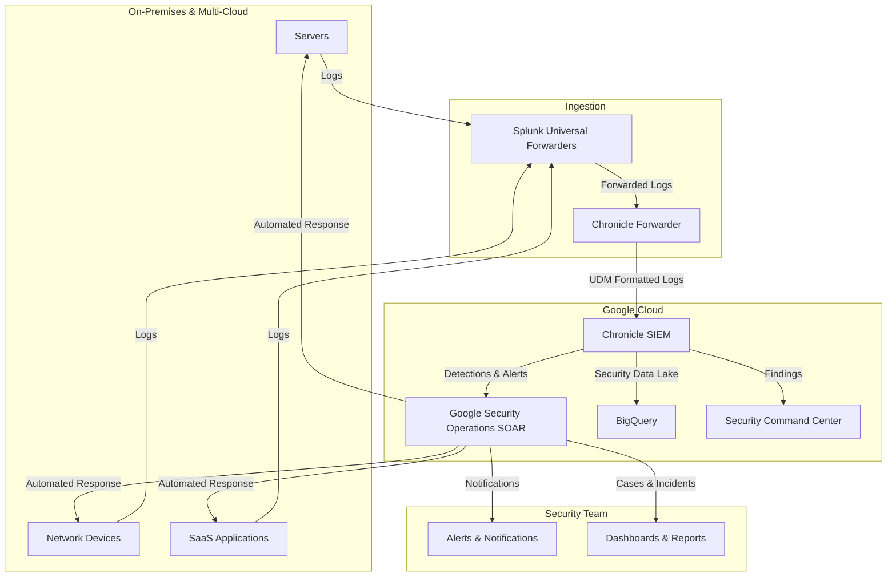

```mermaid
graph TD
    subgraph On-Premises & Multi-Cloud
        A[Servers]
        B[Network Devices]
        C[SaaS Applications]
    end

    subgraph Ingestion
        D[Splunk Universal Forwarders]
        E[Chronicle Forwarder]
    end

    subgraph Google Cloud
        F[Chronicle SIEM]
        G[Google Security Operations SOAR]
        H[BigQuery]
        I[Security Command Center]
    end

    subgraph Security Team
        J[Alerts & Notifications]
        K[Dashboards & Reports]
    end

    A -- Logs --> D
    B -- Logs --> D
    C -- Logs --> D
    D -- Forwarded Logs --> E
    E -- UDM Formatted Logs --> F
    F -- Detections & Alerts --> G
    G -- Automated Response --> A
    G -- Automated Response --> B
    G -- Automated Response --> C
    F -- Security Data Lake --> H
    F -- Findings --> I
    G -- Cases & Incidents --> K
    G -- Notifications --> J

```
