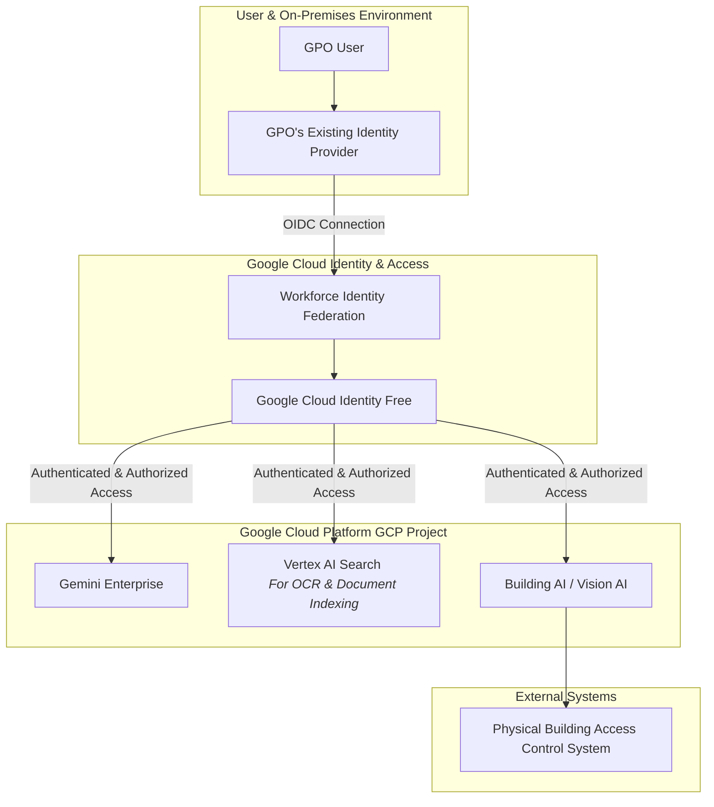

```mermaid
graph TD
    subgraph "User & On-Premises Environment"
        User[GPO User] --> OnPremIdP[GPO's Existing Identity Provider]
    end

    subgraph "Google Cloud Identity & Access"
        OnPremIdP -- OIDC Connection --> WIF[Workforce Identity Federation]
        WIF --> CloudIdentity[Google Cloud Identity Free]
    end

    subgraph "Google Cloud Platform GCP Project"
        Gemini[Gemini Enterprise]
        VertexSearch[Vertex AI Search <br><i>For OCR & Document Indexing</i>]
        VisionAI[Building AI / Vision AI]
    end

    subgraph "External Systems"
        BuildingAccess[Physical Building Access Control System]
    end

    %% Access Path
    CloudIdentity -- Authenticated & Authorized Access --> Gemini
    CloudIdentity -- Authenticated & Authorized Access --> VertexSearch
    CloudIdentity -- Authenticated & Authorized Access --> VisionAI

    %% Service Integration
    VisionAI --> BuildingAccess

```
