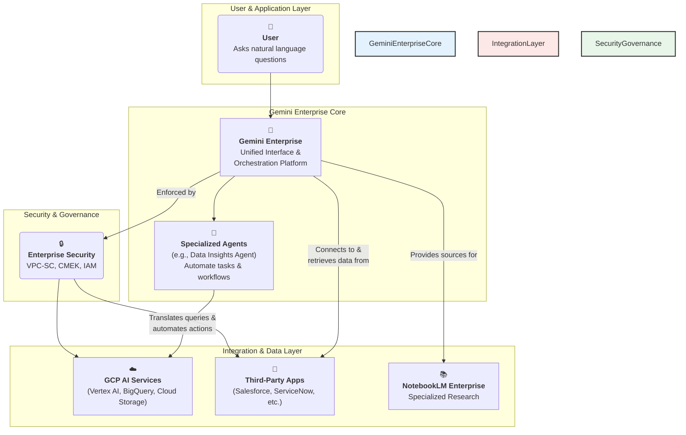

```mermaid
graph TD
    subgraph "User & Application Layer"
        User("👤<br><b>User</b><br>Asks natural language questions")
    end

    subgraph "Gemini Enterprise Core"
        style GeminiEnterpriseCore fill:#e3f2fd,stroke:#333,stroke-width:2px
        Gemini["🚀<br><b>Gemini Enterprise</b><br>Unified Interface &<br>Orchestration Platform"]
        Agents["🤖<br><b>Specialized Agents</b><br>(e.g., Data Insights Agent)<br>Automate tasks & workflows"]
    end

    subgraph "Integration & Data Layer"
        style IntegrationLayer fill:#fce8e6,stroke:#333,stroke-width:2px
        GCP_Services["☁️<br><b>GCP AI Services</b><br>(Vertex AI, BigQuery, Cloud Storage)"]
        ThirdParty["🤝<br><b>Third-Party Apps</b><br>(Salesforce, ServiceNow, etc.)"]
        NotebookLM["📚<br><b>NotebookLM Enterprise</b><br>Specialized Research"]
    end

    subgraph "Security & Governance"
        style SecurityGovernance fill:#e8f5e9,stroke:#333,stroke-width:2px
        Security("🔒<br><b>Enterprise Security</b><br>VPC-SC, CMEK, IAM")
    end

    %% Defining the flow and relationships
    User --> Gemini;
    Gemini --> Agents;
    Agents -- "Translates queries &<br>automates actions" --> GCP_Services;
    Gemini -- "Connects to &<br>retrieves data from" --> ThirdParty;
    Gemini -- "Provides sources for" --> NotebookLM;

    %% Showing that security envelops the interactions
    Gemini -- "Enforced by" --> Security;
    Security --> GCP_Services;
    Security --> ThirdParty;

```
