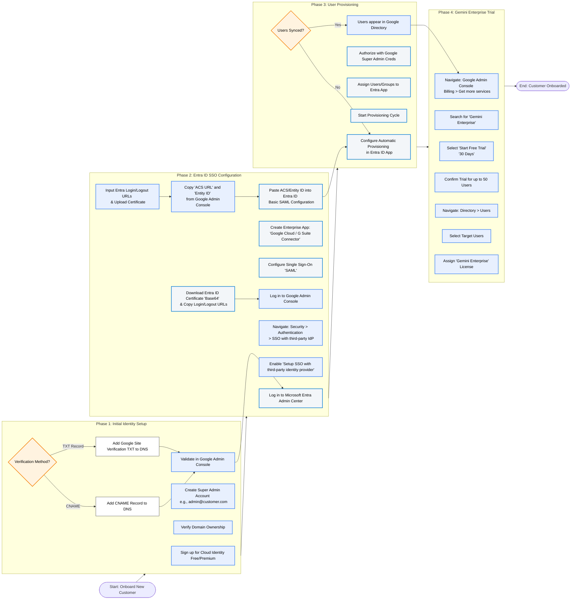

```mermaid
flowchart LR
    %% Define Styles
    classDef gcp fill:#e8f0fe,stroke:#4285f4,stroke-width:2px,color:black;
    classDef azure fill:#f3f6f9,stroke:#0078d4,stroke-width:2px,color:black;
    classDef action fill:#fff,stroke:#333,stroke-width:1px,color:black;
    classDef decision fill:#fff3e0,stroke:#f57c00,stroke-width:2px,color:black;

    Start([Start: Onboard New Customer]) --> InitSetup
    
    subgraph InitSetup [Phase 1: Initial Identity Setup]
        direction TB
        A1[Sign up for Cloud Identity Free/Premium]:::gcp
        A2[Create Super Admin Account <br/> e.g., admin@customer.com]:::gcp
        A3[Verify Domain Ownership]:::gcp
        A4{Verification Method?}:::decision
        A4 -- TXT Record --> A5[Add Google Site Verification TXT to DNS]:::action
        A4 -- CNAME --> A6[Add CNAME Record to DNS]:::action
        A5 --> A7[Validate in Google Admin Console]:::gcp
        A6 --> A7
    end

    InitSetup --> SSOConfig

    subgraph SSOConfig [Phase 2: Entra ID SSO Configuration]
        direction TB
        B1[Log in to Microsoft Entra Admin Center]:::azure
        B2[Create Enterprise App: <br/>'Google Cloud / G Suite Connector']:::azure
        B3[Configure Single Sign-On 'SAML']:::azure
        B4[Download Entra ID Certificate 'Base64' <br/> & Copy Login/Logout URLs]:::azure
        
        B5[Log in to Google Admin Console]:::gcp
        B6[Navigate: Security > Authentication <br/> > SSO with third-party IdP]:::gcp
        B7[Enable 'Setup SSO with third-party identity provider']:::gcp
        B8[Input Entra Login/Logout URLs <br/> & Upload Certificate]:::gcp
        
        B9[Copy 'ACS URL' and 'Entity ID' <br/> from Google Admin Console]:::gcp
        B10[Paste ACS/Entity ID into Entra ID <br/> Basic SAML Configuration]:::azure
        
        B4 --> B5
        B8 --> B9
        B9 --> B10
    end

    SSOConfig --> UserProv

    subgraph UserProv [Phase 3: User Provisioning]
        direction TB
        C1[Configure Automatic Provisioning <br/> in Entra ID App]:::azure
        C2[Authorize with Google Super Admin Creds]:::azure
        C3[Assign Users/Groups to Entra App]:::azure
        C4[Start Provisioning Cycle]:::azure
        C5{Users Synced?}:::decision
        C5 -- Yes --> C6[Users appear in Google Directory]:::gcp
        C5 -- No --> C1
    end

    UserProv --> GeminiTrial

    subgraph GeminiTrial [Phase 4: Gemini Enterprise Trial]
        direction TB
        D1[Navigate: Google Admin Console <br/> Billing > Get more services]:::gcp
        D2[Search for 'Gemini Enterprise']:::gcp
        D3[Select 'Start Free Trial' <br/> '30 Days']:::gcp
        D4[Confirm Trial for up to 50 Users]:::gcp
        D5[Navigate: Directory > Users]:::gcp
        D6[Select Target Users]:::gcp
        D7[Assign 'Gemini Enterprise' License]:::gcp
    end

    GeminiTrial --> End([End: Customer Onboarded])

    %% Link Subgraphs
    A7 --> B1
    B10 --> C1
    C6 --> D1
```
