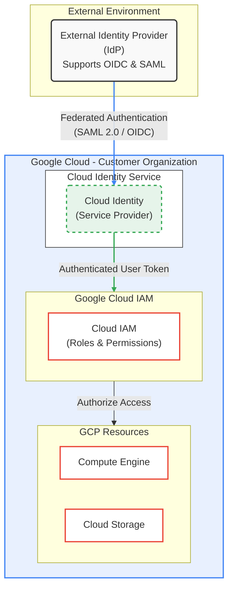

```mermaid
flowchart TD
    %% Styles
    classDef idp fill:#f9f9f9,stroke:#333,stroke-width:2px;
    classDef gcp fill:#e8f0fe,stroke:#4285f4,stroke-width:2px;
    classDef ci fill:#e6f4ea,stroke:#34a853,stroke-width:2px,stroke-dasharray: 5 5;
    classDef resource fill:#fff,stroke:#ea4335,stroke-width:2px;

    subgraph External_Env [External Environment]
        direction TB
        Ext_IdP("External Identity Provider<br/>(IdP)<br/>Supports OIDC & SAML"):::idp
    end

    subgraph Google_Cloud_Org [Google Cloud - Customer Organization]
        direction TB
        style Google_Cloud_Org fill:#e8f0fe,stroke:#4285f4,stroke-width:2px
        
        subgraph Cloud_Identity_Service [Cloud Identity Service]
            style Cloud_Identity_Service fill:#ffffff,stroke:#333,stroke-width:1px
            CI_Node("Cloud Identity<br/>(Service Provider)"):::ci
        end
        
        subgraph IAM_Layer [Google Cloud IAM]
             IAM_Policy["Cloud IAM<br/>(Roles & Permissions)"]:::resource
        end

        subgraph Resources [GCP Resources]
            Compute["Compute Engine"]:::resource
            Storage["Cloud Storage"]:::resource
        end
    end

    %% Connections
    Ext_IdP -- "Federated Authentication<br/>(SAML 2.0 / OIDC)" --> CI_Node
    CI_Node -- "Authenticated User Token" --> IAM_Layer
    IAM_Layer -- "Authorize Access" --> Resources

    %% Link Styling
    linkStyle 0 stroke:#4285f4,stroke-width:2px;
    linkStyle 1 stroke:#34a853,stroke-width:2px;
```
