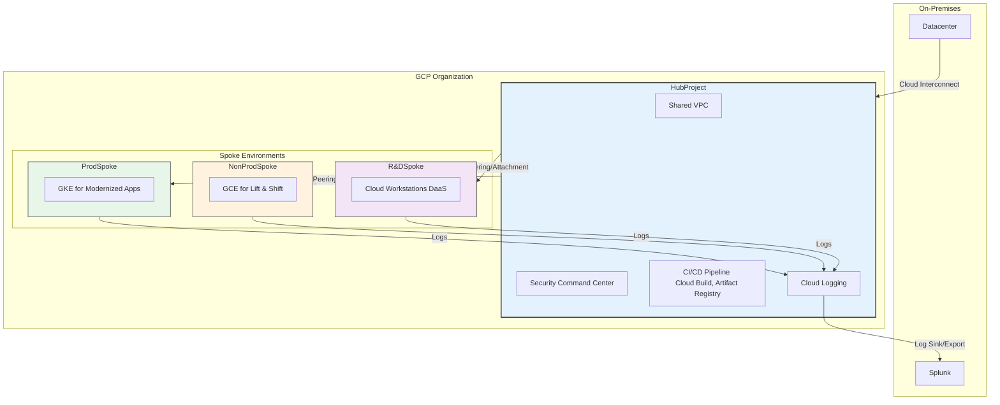

```mermaid
graph TD
    subgraph On-Premises
        direction LR
        OnPremDC[Datacenter]
        OnPremSplunk[Splunk]
    end

    subgraph GCP Organization
        direction TB
        HubProject[Hub Project]
        subgraph HubProject
            direction LR
            SharedVPC[Shared VPC]
            SCC[Security Command Center]
            CICD[CI/CD Pipeline <br>Cloud Build, Artifact Registry]
            Logging[Cloud Logging]
        end

        subgraph Spoke Environments
            direction TB
            ProdSpoke[Production Spoke Project]
            NonProdSpoke[Non-Prod Spoke Project]
            R&DSpoke[R&D Spoke Project]
        end

        subgraph ProdSpoke
            GKE[GKE for Modernized Apps]
        end
        subgraph NonProdSpoke
            GCE[GCE for Lift & Shift]
        end
        subgraph R&DSpoke
            Workstations[Cloud Workstations DaaS]
        end
    end

    OnPremDC -- "Cloud Interconnect" --> HubProject
    HubProject -- "VPC Peering/Attachment" --> ProdSpoke
    HubProject -- "VPC Peering/Attachment" --> NonProdSpoke
    HubProject -- "VPC Peering/Attachment" --> R&DSpoke

    ProdSpoke -- "Logs" --> Logging
    NonProdSpoke -- "Logs" --> Logging
    R&DSpoke -- "Logs" --> Logging
    Logging -- "Log Sink/Export" --> OnPremSplunk

    style HubProject fill:#e3f2fd,stroke:#333,stroke-width:2px
    style ProdSpoke fill:#e8f5e9,stroke:#333,stroke-width:1px
    style NonProdSpoke fill:#fff3e0,stroke:#333,stroke-width:1px
    style R&DSpoke fill:#f3e5f5,stroke:#333,stroke-width:1px

```
