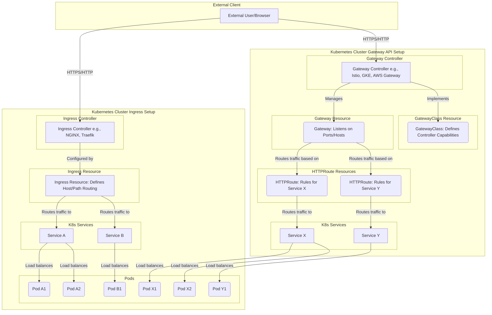

```mermaid
graph TD
    subgraph External Client
        Client[External User/Browser]
    end

    subgraph Kubernetes Cluster Ingress Setup
        direction LR
        subgraph Ingress Controller
            IC[Ingress Controller e.g., NGINX, Traefik]
        end

        subgraph Ingress Resource
            IR[Ingress Resource: Defines Host/Path Routing]
        end

        subgraph K8s Services
            ServiceA[Service A]
            ServiceB[Service B]
        end

        subgraph Pods
            PodA1(Pod A1)
            PodA2(Pod A2)
            PodB1(Pod B1)
        end

        Client -- HTTPS/HTTP --> IC
        IC -- Configured by --> IR
        IR -- Routes traffic to --> ServiceA
        IR -- Routes traffic to --> ServiceB
        ServiceA -- Load balances --> PodA1
        ServiceA -- Load balances --> PodA2
        ServiceB -- Load balances --> PodB1
    end

    subgraph Kubernetes Cluster Gateway API Setup
        direction LR
        subgraph Gateway Controller
            GC[Gateway Controller e.g., Istio, GKE, AWS Gateway]
        end

        subgraph GatewayClass Resource
            GwC(GatewayClass: Defines Controller Capabilities)
        end

        subgraph Gateway Resource
            Gw(Gateway: Listens on Ports/Hosts)
        end

        subgraph HTTPRoute Resources
            HR1(HTTPRoute: Rules for Service X)
            HR2(HTTPRoute: Rules for Service Y)
        end

        subgraph K8s Services
            ServiceX[Service X]
            ServiceY[Service Y]
        end

        subgraph Pods
            PodX1(Pod X1)
            PodX2(Pod X2)
            PodY1(Pod Y1)
        end

        Client -- HTTPS/HTTP --> GC
        GC -- Implements --> GwC
        GC -- Manages --> Gw
        Gw -- Routes traffic based on --> HR1
        Gw -- Routes traffic based on --> HR2
        HR1 -- Routes traffic to --> ServiceX
        HR2 -- Routes traffic to --> ServiceY
        ServiceX -- Load balances --> PodX1
        ServiceX -- Load balances --> PodX2
        ServiceY -- Load balances --> PodY1
    end
```
