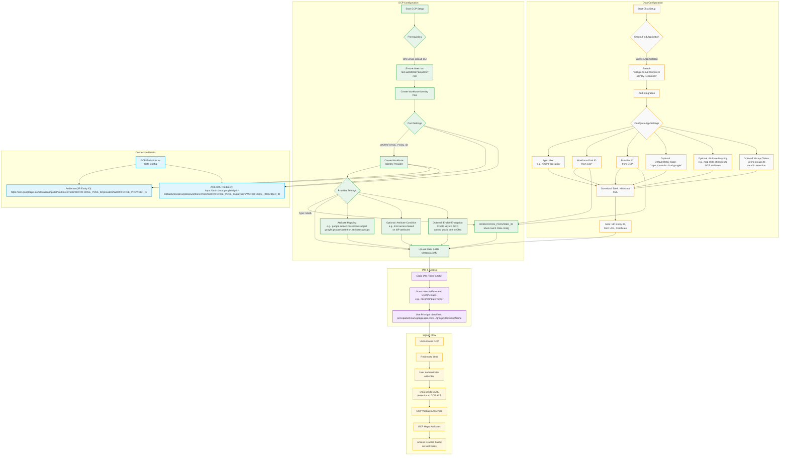

```mermaid
graph TD
    subgraph Okta Configuration
        A[Start Okta Setup] --> B{Create/Find Application};
        B --> |"Browse App Catalog"| C["Search <br>'Google Cloud Workforce <br>Identity Federation'"];
        C --> D[Add Integration];
        D --> E{Configure App Settings};
        E --> F[App Label: <br>e.g., 'GCP Federation'];
        E --> G[Workforce Pool ID: <br/>from GCP];
        E --> H[Provider ID: <br/>from GCP];
        E --> I[Optional: <br>Default Relay State: <br/>'https://console.cloud.google/'];
        E --> J[Optional: Attribute Mapping <br/>e.g., map Okta attributes to <br>GCP attributes];
        E --> K[Optional: Group Claims <br/>Define groups to <br>send in assertion];
        K --> L[Download SAML Metadata <br>XML];
        L --> M[Note: IdP Entity ID, <br>SSO URL, Certificate];
        I --> L;
        J --> L;
        F --> L;
        G --> L;
        H --> L;
    end

    subgraph GCP Configuration
        N[Start GCP Setup] --> O{Prerequisites};
        O --> |"Org Setup, gcloud CLI"| P[Ensure User has <br>'iam.workforcePoolAdmin' <br>role];
        P --> Q[Create Workforce Identity Pool];
        Q --> R{Pool Settings};
        R --> |"WORKFORCE_POOL_ID"| S[Create Workforce <br>Identity Provider];
        S --> T{Provider Settings};
        T --> |"Type: SAML"| U[WORKFORCE_PROVIDER_ID <br/>Must match Okta config];
        T --> V[Upload Okta SAML Metadata XML];
        T --> W[Attribute Mapping <br/>e.g., google.subject=assertion.subject <br/>google.groups=assertion.attributes.groups];
        T --> X[Optional: Attribute Condition <br/>e.g., limit access based <br>on IdP attributes];
        T --> Y[Optional: Enable Encryption <br/>Create keys in GCP, <br>upload public cert to Okta];
        U --> V;
        W --> V;
        X --> V;
        Y --> V;
    end

    subgraph Connection Details
        Z[GCP Endpoints for <br>Okta Config];
        Z --> AA["Audience (SP Entity ID): <br/>https://iam.googleapis.com/locations/global/workforcePools/WORKFORCE_POOL_ID/providers/WORKFORCE_PROVIDER_ID"];
        Z --> AB["ACS URL (Redirect): <br/>https://auth.cloud.google/signin-callback/locations/global/workforcePools/WORKFORCE_POOL_ID/providers/WORKFORCE_PROVIDER_ID"];
    end

    subgraph IAM & Access
        AC[Grant IAM Roles in GCP];
        AC --> AD["Grant roles to Federated Users/Groups <br/>e.g., roles/compute.viewer"];
        AD --> AE["Use Principal Identifiers: <br/>principalSet://iam.googleapis.com/.../group/OktaGroupName"];
    end

    subgraph Sign-in Flow
        AF[User Access GCP] --> AG[Redirect to Okta];
        AG --> AH[User Authenticates <br>with Okta];
        AH --> AI[Okta sends SAML <br>Assertion to GCP ACS];
        AI --> AJ[GCP Validates Assertion];
        AJ --> AK[GCP Maps Attributes];
        AK --> AL[Access Granted based <br>on IAM Roles];
    end

    %% Styling
    classDef okta fill:#F9F9F9,stroke:#F5A623,stroke-width:2px;
    classDef gcp fill:#E6F4EA,stroke:#34A853,stroke-width:2px;
    classDef conn fill:#E1F5FE,stroke:#039BE5,stroke-width:2px;
    classDef iam fill:#F3E8FD,stroke:#9334E6,stroke-width:2px;
    classDef flow fill:#FEF7E0,stroke:#FBBC04,stroke-width:2px;

    class A,B,C,D,E,F,G,H,I,J,K,L,M okta;
    class N,O,P,Q,R,S,T,U,V,W,X,Y gcp;
    class Z,AA,AB conn;
    class AC,AD,AE iam;
    class AF,AG,AH,AI,AJ,AK,AL flow;

    %% Relationships
    M --> V;
    G --> U;
    H --> U;
    R --> AA;
    S --> AA;
    R --> AB;
    S --> AB;
    V --> AC;
    AE --> AF;

```
