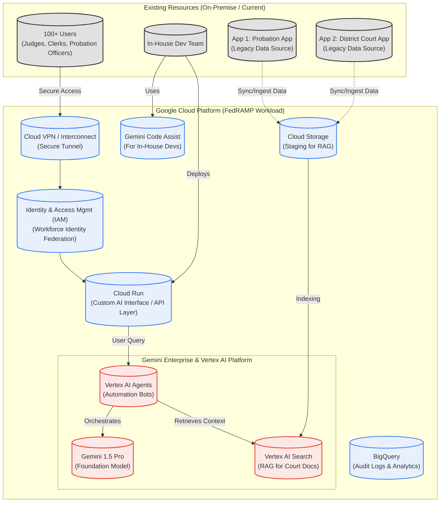

```mermaid
graph TD
    subgraph "Existing Resources (On-Premise / Current)"
        Users[("100+ Users<br/>(Judges, Clerks, Probation Officers)")]
        DevTeam[("In-House Dev Team")]
        LegacyApp1[("App 1: Probation App<br/>(Legacy Data Source)")]
        LegacyApp2[("App 2: District Court App<br/>(Legacy Data Source)")]
    end

    subgraph "Google Cloud Platform (FedRAMP Workload)"
        
        %% Connectivity Layer
        VPN[("Cloud VPN / Interconnect<br/>(Secure Tunnel)")]
        
        %% Security & Identity
        IAM[("Identity & Access Mgmt (IAM)<br/>(Workforce Identity Federation)")]
        
        %% The AI "Brain" Layer
        subgraph "Gemini Enterprise & Vertex AI Platform"
            VertexSearch[("Vertex AI Search<br/>(RAG for Court Docs)")]
            VertexAgents[("Vertex AI Agents<br/>(Automation Bots)")]
            GeminiModels[("Gemini 1.5 Pro<br/>(Foundation Model)")]
        end

        %% Application Hosting (The "Glue")
        CloudRun[("Cloud Run<br/>(Custom AI Interface / API Layer)")]
        
        %% Developer Tools
        GeminiCode[("Gemini Code Assist<br/>(For In-House Devs)")]

        %% Data Ingestion
        Storage[("Cloud Storage<br/>(Staging for RAG)")]
        BigQuery[("BigQuery<br/>(Audit Logs & Analytics)")]
    end

    %% Flows
    Users -->|Secure Access| VPN
    VPN --> IAM
    IAM --> CloudRun
    
    %% Dev Flow
    DevTeam -->|Uses| GeminiCode
    DevTeam -->|Deploys| CloudRun
    
    %% AI Processing Flow
    CloudRun -->|User Query| VertexAgents
    VertexAgents -->|Orchestrates| GeminiModels
    VertexAgents -->|Retrieves Context| VertexSearch
    
    %% Grounding Flow (The "Hybrid" Link)
    LegacyApp1 -.->|Sync/Ingest Data| Storage
    LegacyApp2 -.->|Sync/Ingest Data| Storage
    Storage -->|Indexing| VertexSearch

    %% Styling
    classDef legacy fill:#e1e1e1,stroke:#333,stroke-width:2px;
    classDef gcp fill:#e8f0fe,stroke:#4285f4,stroke-width:2px;
    classDef ai fill:#fce8e6,stroke:#ea4335,stroke-width:2px;
    
    class Users,DevTeam,LegacyApp1,LegacyApp2 legacy;
    class VPN,IAM,CloudRun,GeminiCode,Storage,BigQuery gcp;
    class VertexSearch,VertexAgents,GeminiModels ai;
    
```
