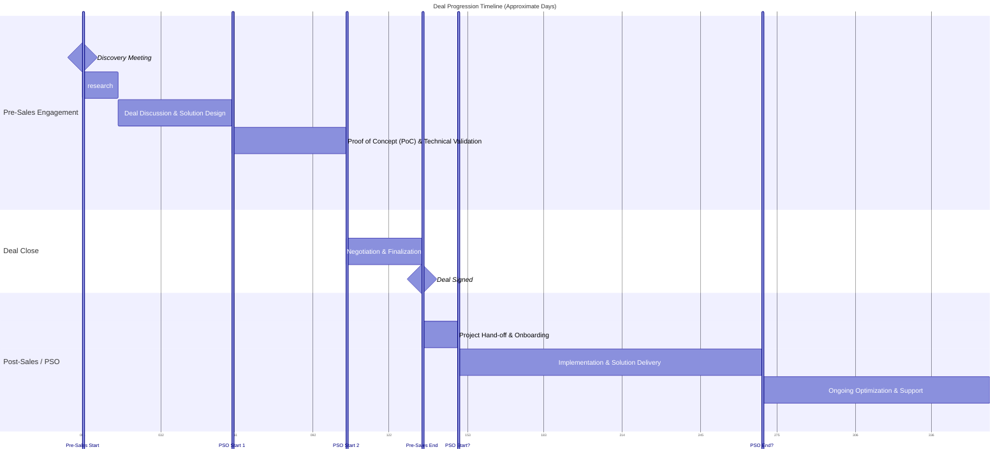

```mermaid
---
config:
  theme: default
  displayMode: compact
  gantt:
    useWidth: 3000
    leftPadding: 250
    rightPadding: 0
    topAxis: false #true
    numberSectionStyles: 2
    fontSize: 20
    sectionFontSize: 22
    barHeight: 80
---
gantt
    dateFormat YYYY-MM-DD
    axisFormat %j
    %% Default axisFormat %Y-%m-%d
    title Deal Progression Timeline (Approximate Days)
    

    section Pre-Sales Engagement
    Pre-Sales Start : vert, v1, 2024-01-01, 1d
    Discovery Meeting : milestone, task0, 2024-01-01, 0d
    research : task1, 2024-01-01, 14d
    Deal Discussion & Solution Design : task2, after task1, 45d
    Proof of Concept (PoC) & Technical Validation : task3, after task2, 45d
    PSO Start 1 : vert, v4, after task2, 1d
    PSO Start 2 : vert, v5, after task3, 1d

    section Deal Close
    Pre-Sales End : vert, v2, after task4, 1d
    Negotiation & Finalization : task4, after task3, 30d
    Deal Signed : milestone, task5, after task4, 0d

    section Post-Sales / PSO
    PSO Start? : vert, v3, after task6, 1d
    Project Hand-off & Onboarding : task6, after task5, 14d
    Implementation & Solution Delivery : task7, after task6, 120d
    Ongoing Optimization & Support : task8, after task7, 90d
    PSO End? : vert, v6, after task7, 1d
```
