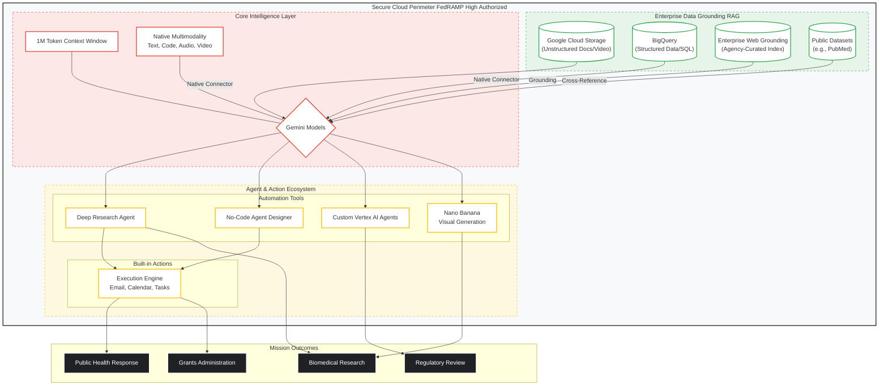

```mermaid
graph TD
    %% Define Styles
    classDef security fill:#e8f0fe,stroke:#1a73e8,stroke-width:2px,stroke-dasharray: 5 5;
    classDef storage fill:#fff,stroke:#34a853,stroke-width:2px;
    classDef compute fill:#fff,stroke:#ea4335,stroke-width:2px;
    classDef tools fill:#fff,stroke:#fbbc04,stroke-width:2px;
    classDef user fill:#202124,stroke:#fff,stroke-width:2px,color:#fff;

    %% Main Wrapper: FedRAMP High Boundary
    subgraph FedRAMP_Perimeter [Secure Cloud Perimeter FedRAMP High Authorized]
        direction TB
        style FedRAMP_Perimeter fill:#f8f9fa,stroke:#202124,stroke-width:2px

        %% Layer 1: Data Grounding
        subgraph Data_Layer [Enterprise Data Grounding RAG]
            style Data_Layer fill:#e6f4ea,stroke:#34a853,stroke-dasharray: 5 5
            GCS[("Google Cloud Storage<br/>(Unstructured Docs/Video)")]:::storage
            BQ[("BigQuery<br/>(Structured Data/SQL)")]:::storage
            WebIndex[("Enterprise Web Grounding<br/>(Agency-Curated Index)")]:::storage
            PubData[("Public Datasets<br/>(e.g., PubMed)")]:::storage
        end

        %% Layer 2: Core Intelligence
        subgraph Model_Layer [Core Intelligence Layer]
            style Model_Layer fill:#fce8e6,stroke:#ea4335,stroke-dasharray: 5 5
            Gemini{Gemini Models}:::compute
            Context[1M Token Context Window]:::compute
            MultiMod[Native Multimodality<br/>Text, Code, Audio, Video]:::compute
            
            %% Relationships within Model Layer
            Context --- Gemini
            MultiMod --- Gemini
        end

        %% Layer 3: Agents & Actions
        subgraph Agent_Layer [Agent & Action Ecosystem]
            style Agent_Layer fill:#fff8e1,stroke:#fbbc04,stroke-dasharray: 5 5
            
            subgraph Auto_Tools [Automation Tools]
                DeepRes[Deep Research Agent]:::tools
                NoCode[No-Code Agent Designer]:::tools
                VertexAgents[Custom Vertex AI Agents]:::tools
                Nano[Nano Banana<br/>Visual Generation]:::tools
            end

            subgraph Action_Hub [Built-in Actions]
                Exec[Execution Engine<br/>Email, Calendar, Tasks]:::tools
            end
        end
    end

    %% Layer 4: Mission Impact (Outside Technical Stack, but driven by it)
    subgraph Mission_Outcomes [Mission Outcomes]
        Bio[Biomedical Research]:::user
        PH[Public Health Response]:::user
        Reg[Regulatory Review]:::user
        Grants[Grants Administration]:::user
    end

    %% Data Flow Connections
    GCS -->|Native Connector| Gemini
    BQ -->|Native Connector| Gemini
    WebIndex -->|Grounding| Gemini
    PubData -->|Cross-Reference| Gemini

    %% Intelligence Flow
    Gemini --> DeepRes
    Gemini --> NoCode
    Gemini --> VertexAgents
    Gemini --> Nano

    %% Action Flow
    NoCode --> Exec
    DeepRes --> Exec
    
    %% Output Flow
    DeepRes --> Bio
    Exec --> PH
    VertexAgents --> Reg
    Nano --> Bio
    Exec --> Grants

```
