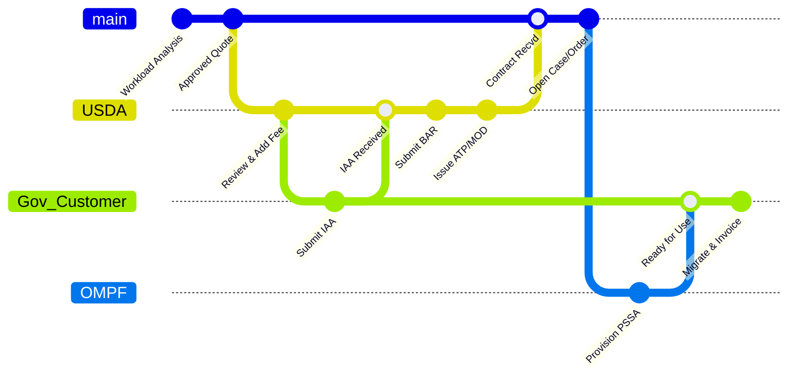

```mermaid
gitGraph
   %% OPP represents the 'main' branch
   commit id: "Workload Analysis"
   commit id: "Approved Quote"
   
   %% Handoff to USDA
   branch USDA
   checkout USDA
   commit id: "Review & Add Fee"
   
   %% Handoff to Customer
   branch Gov_Customer
   checkout Gov_Customer
   commit id: "Submit IAA"
   
   %% Return to USDA
   checkout USDA
   merge Gov_Customer id: "IAA Received"
   commit id: "Submit BAR"
   commit id: "Issue ATP/MOD"
   
   %% Return to OPP
   checkout main
   merge USDA id: "Contract Recvd"
   commit id: "Open Case/Order"
   
   %% Handoff to OMPF
   branch OMPF
   checkout OMPF
   commit id: "Provision PSSA"
   
   %% Final Handoff to Customer
   checkout Gov_Customer
   merge OMPF id: "Ready for Use"
   commit id: "Migrate & Invoice"
```
