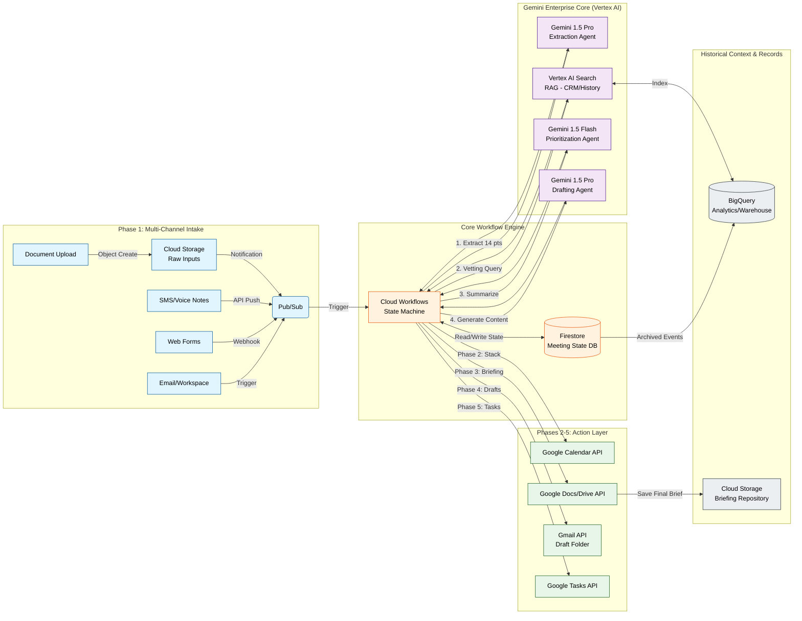

```mermaid
flowchart LR
    subgraph Ingestion ["Phase 1: Multi-Channel Intake"]
        A1[Email/Workspace] -->|Trigger| B(Pub/Sub)
        A2[Web Forms] -->|Webhook| B
        A3[SMS/Voice Notes] -->|API Push| B
        A4[Document Upload] -->|Object Create| GCS_RAW[Cloud Storage\nRaw Inputs]
        GCS_RAW -->|Notification| B
    end

    subgraph Orchestration ["Core Workflow Engine"]
        B -->|Trigger| WORKFLOW[Cloud Workflows\nState Machine]
        WORKFLOW <-->|Read/Write State| FIRESTORE[(Firestore\nMeeting State DB)]
    end

    subgraph Intelligence ["Gemini Enterprise Core (Vertex AI)"]
        WORKFLOW -->|1. Extract 14 pts| GEM_EXTRACT[Gemini 1.5 Pro\nExtraction Agent]
        WORKFLOW -->|2. Vetting Query| V_SEARCH[Vertex AI Search\nRAG - CRM/History]
        WORKFLOW -->|3. Summarize| GEM_SUM[Gemini 1.5 Flash\nPrioritization Agent]
        WORKFLOW -->|4. Generate Content| GEM_GEN[Gemini 1.5 Pro\nDrafting Agent]
        GEM_EXTRACT --> WORKFLOW
        V_SEARCH --> WORKFLOW
        GEM_SUM --> WORKFLOW
        GEM_GEN --> WORKFLOW
    end

    subgraph Action_Services ["Phases 2-5: Action Layer"]
        WORKFLOW -->|Phase 2: Stack| CAL_API[Google Calendar API]
        WORKFLOW -->|Phase 3: Briefing| DOCS_API[Google Docs/Drive API]
        WORKFLOW -->|Phase 4: Drafts| GMAIL_API[Gmail API\nDraft Folder]
        WORKFLOW -->|Phase 5: Tasks| TASKS_API[Google Tasks API]
    end

    subgraph Data_Layer ["Historical Context & Records"]
        FIRESTORE -->|Archived Events| BQ[(BigQuery\nAnalytics/Warehouse)]
        V_SEARCH <-->|Index| BQ
        DOCS_API -->|Save Final Brief| GCS_FINAL[Cloud Storage\nBriefing Repository]
    end

    classDef ingest fill:#e1f5fe,stroke:#01579b,color:#000;
    classDef core fill:#fff3e0,stroke:#e65100,color:#000;
    classDef ai fill:#f3e5f5,stroke:#4a148c,color:#000;
    classDef action fill:#e8f5e9,stroke:#1b5e20,color:#000;
    classDef data fill:#eceff1,stroke:#263238,color:#000;

    class A1,A2,A3,A4,B,GCS_RAW ingest;
    class WORKFLOW,FIRESTORE core;
    class GEM_EXTRACT,V_SEARCH,GEM_SUM,GEM_GEN ai;
    class CAL_API,DOCS_API,GMAIL_API,TASKS_API action;
    class BQ,GCS_FINAL data;
```
